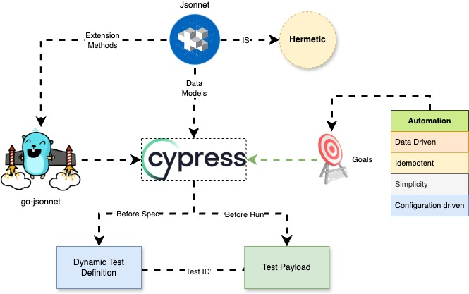

<h1 align="center">Welcome to Cypress Jsonnet plugin example for Dynamic test👋</h1>

## ✨ Description

`cy-jsonnet-dynamic` is sample implementation to show how its uses [cy-jsonnet](https://www.npmjs.com/package/cy-jsonnet).

**Core Ideas :** 
- Dynamic test case generation using Jsonnet
- Coverage for Positive and Negative scenarios

## 🚀 Integration of cypress-jsonnet.

1. Pre-requisite : Make sure you have these softwares 
   - [Golang](https://go.dev/doc/install)
      - Recommended version: > 1.20
   - [node js](https://nodejs.org/en/download)
      - Make sure the node version is 16.x or higher
   - [VS Code](https://code.visualstudio.com/download)
   - [Go-Jsonnet](https://github.com/google/go-jsonnet)
      - Run `go install github.com/google/go-jsonnet/cmd/jsonnet@latest`

2. Clone this repo `git clone https://github.com/skaiit/cy-jsonnet-dynamic.git`
3. Open your favorite terminal window and `cd` to the folder.
4. Run `npm install` to install dependencies.
5. Now we can see how dynamic test and data from jsonnet can load into person.cy.ts
   - Run 🏃 `npx cypress open --e2e`
   - Select `person.cy.ts`
6. This will help with running using grep tags
         ` npx cypress run --env grepTags="sanity"`
    - More examples [@cypress/grep](https://www.npmjs.com/package/@cypress/grep)

### 📜 Use all the supported features of [jsonnet](https://jsonnet.org/learning/tutorial.html) and [gofakeit](https://pkg.go.dev/github.com/brianvoe/gofakeit/v7#readme-simple-usage).

## 🤝 Contribution

Contributions, issues and feature requests are welcome. Please email your ideas to us. 

## Show your support

If you find this useful please spread the words :thumbsup:

## 📝 License

This project is [MIT] licensed.
